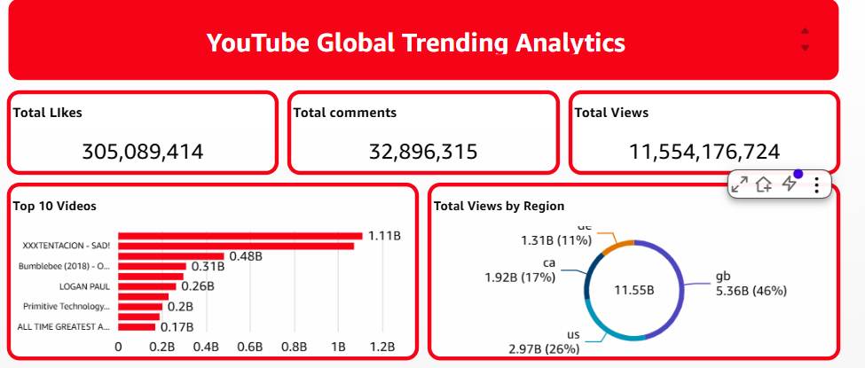
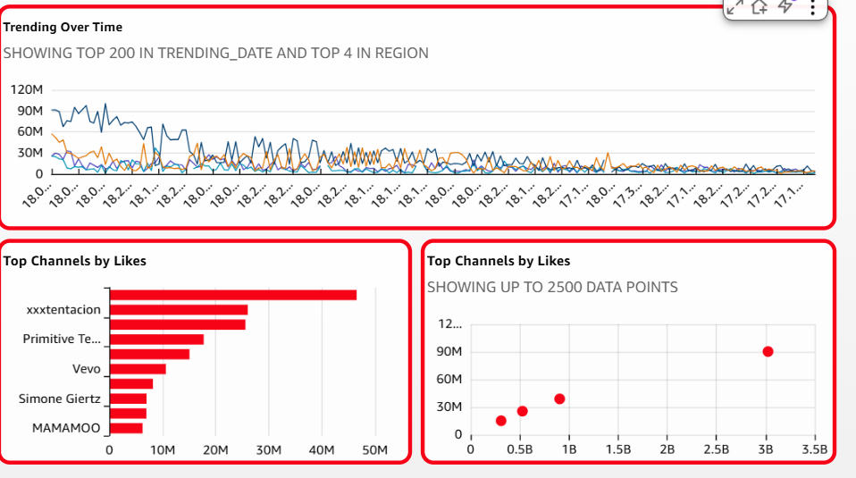

# 📊 YouTube Global Trending Analytics — AWS Data Engineering Pipeline



## 🗂️ Project Overview

An end-to-end cloud data engineering pipeline that processes **643,000+ YouTube trending video records** across **9 global regions**, transforming raw regional CSV files into a fully queryable analytics layer and interactive QuickSight dashboard.

---

## 🏗️ Architecture

```
┌─────────────────────────────────────────────────────────────────┐
│                        DATA PIPELINE                            │
│                                                                 │
│  Raw CSV Files          AWS Glue              Analytics         │
│  (9 Regions)            ETL Job               Layer            │
│                                                                 │
│  S3 Raw Bucket  ──►  Glue Crawler  ──►  Glue ETL Job           │
│  region=ca/          (Schema           (Encoding Fix +          │
│  region=gb/           Detection)        PySpark Transform)      │
│  region=us/               │                    │               │
│  region=jp/               ▼                    ▼               │
│  region=kr/         Glue Data           S3 Analytics Bucket     │
│  region=mx/          Catalog            (Parquet, partitioned   │
│  region=de/         (raw table)          by region)            │
│  region=fr/                                    │               │
│  region=ru/                                    ▼               │
│                                         Glue Crawler            │
│                                         (parquet table)         │
│                                                │               │
│                                                ▼               │
│                                           Amazon Athena         │
│                                           (SQL queries)         │
│                                                │               │
│                                                ▼               │
│                                         QuickSight Dashboard    │
│                                         (Visualizations)        │
└─────────────────────────────────────────────────────────────────┘
```

---

## 🛠️ Tech Stack

| Layer | Technology |
|---|---|
| Storage | Amazon S3 |
| Cataloging | AWS Glue Data Catalog |
| ETL | AWS Glue Studio (PySpark) |
| Querying | Amazon Athena |
| Visualization | Amazon QuickSight |
| CLI | AWS CLI |
| Language | Python, PySpark, SQL |

---

## 📁 Repository Structure

```
youtube-de-project/
│
├── glue_jobs/
│   └── etl_youtube_analytics.py     # Main Glue ETL PySpark script
│
├── sql/
│   └── athena_queries.sql           # Sample Athena queries
│
├── assets/
│   ├── dashboard_overview.png       # QuickSight dashboard screenshot
│   └── dashboard_charts.png         # Charts detail screenshot
│
└── README.md
```

---

## 🔧 Pipeline Breakdown

### 1. Data Ingestion — S3
Raw CSV files uploaded per region using AWS CLI:
```bash
aws s3 cp CAvideos.csv s3://your-bucket/youtube/raw_statistics/region=ca/
aws s3 cp USvideos.csv s3://your-bucket/youtube/raw_statistics/region=us/
# ... repeated for all 9 regions
```

### 2. Schema Detection — AWS Glue Crawler
- Crawled S3 raw path to detect schema automatically
- Registered table `raw_statistics` in Glue Data Catalog
- Database: `de-youtube-raw`

### 3. ETL Transformation — AWS Glue (PySpark)
Key challenges solved:
- **Multi-encoding issue**: Different regions used different encodings (UTF-8 for JP/KR/RU, ISO-8859-1 for MX/FR/DE)
- **CSV parse failures**: Fixed using PySpark's PERMISSIVE read mode
- **Output format**: Converted CSV → Parquet (columnar, compressed) partitioned by region

### 4. Analytics Querying — Amazon Athena
```sql
-- Top trending videos by views
SELECT title, channel, region, SUM(views) as total_views
FROM raw_statistics_parquet
GROUP BY title, channel, region
ORDER BY total_views DESC
LIMIT 10;

-- Views by region
SELECT region, SUM(views) as total_views
FROM raw_statistics_parquet
GROUP BY region
ORDER BY total_views DESC;
```

### 5. Visualization — Amazon QuickSight

---

## 📊 Dashboard

### Overview — KPIs + Top Videos + Regional Distribution


| Metric | Value |
|---|---|
| Total Views | 11,554,176,724 |
| Total Likes | 305,089,414 |
| Total Comments | 32,896,315 |

### Trending Over Time + Channel Analysis


**Key Insights:**
- 🇬🇧 **GB (UK)** dominates with **46%** of total views (5.36B)
- 🇺🇸 **US** contributes **26%** of total views (2.97B)
- 🎵 **XXXTENTACION** is the top channel by likes (~50M)
- 📈 Trending views peak around late 2017–early 2018

---

## 🚀 How to Reproduce

### Prerequisites
- AWS Account with IAM permissions for S3, Glue, Athena, QuickSight
- AWS CLI configured (`aws configure`)
- YouTube trending dataset (Kaggle)

### Steps

**1. Upload raw data to S3:**
```bash
aws s3 cp <region>videos.csv s3://<your-bucket>/youtube/raw_statistics/region=<region>/
```

**2. Run Glue Crawler on raw S3 path**

**3. Run the Glue ETL job:**
```bash
# Deploy glue_jobs/etl_youtube_analytics.py as a Glue job
# Set Glue version: 4.0, Worker: G.1X, Workers: 2
```

**4. Run Glue Crawler on Parquet output path**

**5. Query in Athena:**
```sql
SELECT * FROM raw_statistics_parquet LIMIT 10;
```

**6. Connect Athena as QuickSight data source and build dashboard**

---

## 📌 Key Learnings

- Handling **multi-encoding CSV files** in distributed PySpark environments
- Difference between **Glue DynamicFrame** and **Spark DataFrame** APIs
- Partitioned **Parquet** output significantly reduces Athena query cost
- AWS Glue Studio Visual ETL limitations vs Script mode flexibility

---

## 👤 Author

**Anshuman Singh**
B.Tech Computer Engineering | Galgotias University (2027)
- GitHub: [Anshuman0509](https://github.com/Anshuman0509)

---

## 🏷️ Tags
`AWS` `Data Engineering` `Glue ETL` `PySpark` `S3` `Athena` `QuickSight` `Parquet` `YouTube Analytics` `Cloud`
